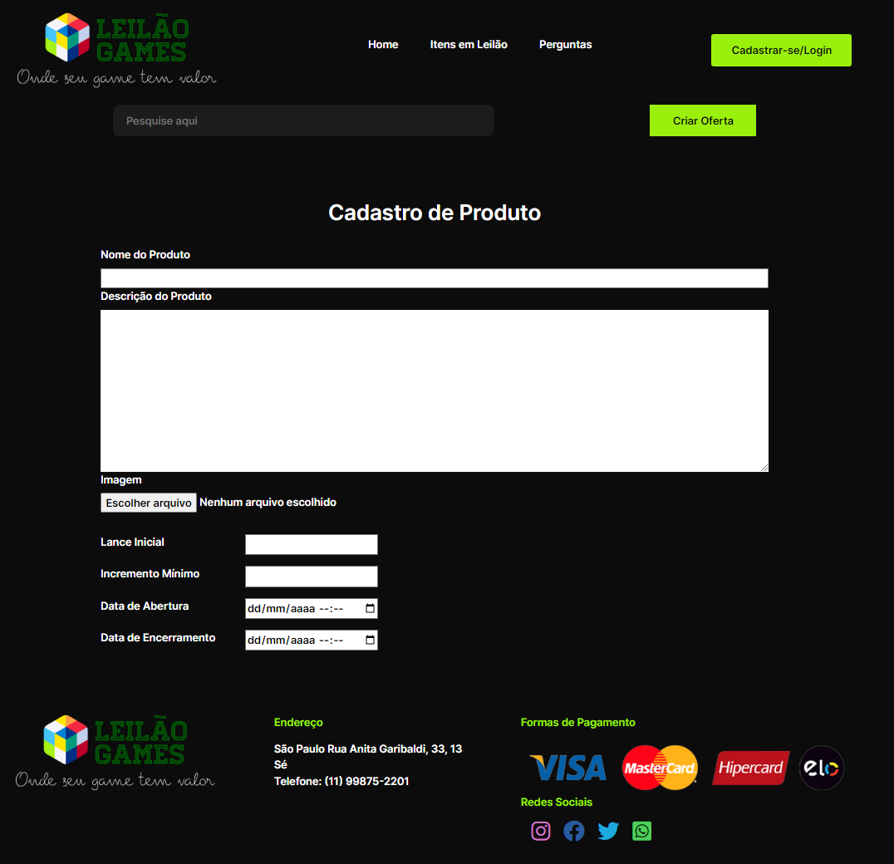

# Site Leilão de Games e Periféricos
## Projeto da Faculdade

O site desenvolvido tem como objetivo, leiloar vários produtos eletrônicos voltados para games.

Nosso foco é criar um site onde o usuário consiga leiloar e/ou dar lances para adquirir: vídeo games,
jogos, periféricos, etc.

Para que o usuário consiga interagir com o site, será necessário a realização do cadastro com
seus dados pessoais, sujeito a validações das informações inseridas.

Após o cadastro, o usuário poderá acessar nosso painel administrativo, podendo cadastrar os itens
para serem leiloados, ou participar de algum leilão em andamento. Todos os itens terão um
lance inicial, e em questão dos lances, deve sempre respeitar o valor mínimo. O objeto leiloado terá o período fixado de abertura e encerramento do leilão.

A cada item arrematado, o usuário deverá pagar uma taxa de comissionamento ao site.

Se o usuário arrematar algum produto e não realizar o pagamento do mesmo dentro do período de
24hrs, o site cobrará uma taxa de desistência no valor estipulado nos termos de uso. Caso
permaneça a inadimplência, o usuário terá seu acesso bloqueado no site e sua dívida poderá ser
cadastrada junto aos orgãos de cobranças.

## `Página Home`

## `Página Cadastro de Produto`

## `Modal Login`

## `Página Produto`

